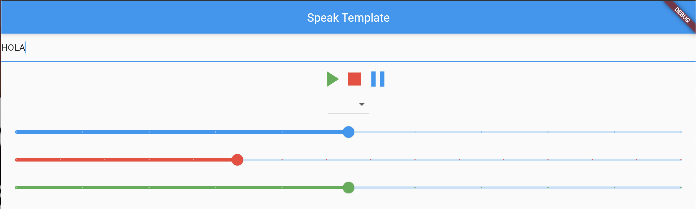

# Speak through an App

In the folder "/android/app/build.gradle" insert:

    minSdkVersion 21
    
In the "pubspec.yaml" insert

    dependencies:
      flutter:
        sdk: flutter
      flutter_tts: ^3.2.1

